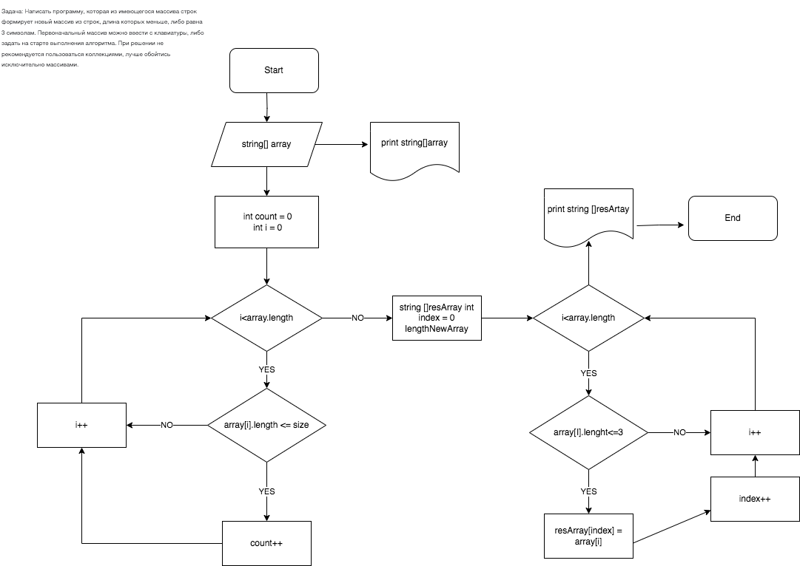

Итоговая контрольная работа по основному блоку
Урок 1. Контрольная работа
Данная работа необходима для проверки ваших знаний и навыков по итогу прохождения первого блока обучения на программе Разработчик. Мы должны убедится, что базовое знакомство с IT прошло успешно.

Задача алгоритмически не самая сложная, однако для полноценного выполнения проверочной работы необходимо:

1. Создать репозиторий на GitHub

https://github.com/Cosmatik/FinalControlWork.git

2. Нарисовать блок-схему алгоритма (можно обойтись блок-схемой основной содержательной части, если вы выделяете её в отдельный метод)

 

3. Снабдить репозиторий оформленным текстовым описанием решения (файл README.md)

** Инструкция к решению задачи: **

3.1 Очистите консоль с помощью команды Console.Clear().

3.2 Создайте массив array и заполните его значениями: "Hello", "2", "world", "!!!".

3.3 Выведите содержимое массива array, используя функцию PrintArray(array). Массив будет отображен в виде [Hello, 2, world, !!!!].

3.4 Выведите символ ->, который указывает на действие, которое будет выполнено с массивом.

3.5 Вычислите размер нового массива, который будет создан на основе исходного массива array. Для этого вызовите функцию ArrLength(array), которая возвращает количество элементов в исходном массиве, у которых длина строки не превышает 3 символа. Результат будет сохранен в переменной sizeNewArray.

3.6 Создайте новый массив result с помощью функции NewArray(array, sizeNewArray). Эта функция создает новый массив, содержащий только те элементы исходного массива array, у которых длина строки не превышает 3 символа.

3.7 Выведите содержимое нового массива result, используя функцию PrintArray(result). Массив будет отображен в виде [2, !!!], так как только два элемента исходного массива удовлетворяют условию длины строки.

3.8 Завершите выполнение программы (dotnet run)

4. Написать программу, решающую поставленную задачу

Console.Clear();
string[] array = { "Hello", "2", "world", "!!!" };
PrintArray(array);
Console.Write(" -> ");

int sizeNewArray = ArrLength(array);

string[] result = NewArray(array, sizeNewArray);

PrintArray(result);

int ArrLength(string[] array)
{
  int count = 0;
  for (int i = 0; i < array.Length; i++)
  {
    if (array[i].Length <= 3) count++;
  }
  return count;
}

string[] NewArray(string[] array, int sizeNewArray)
{
  int index = 0;
  string[] result = new string[sizeNewArray];

  for (int i = 0; i < array.Length; i++)
  {
    if (array[i].Length <= 3)
    {
      result[index] = array[i];
      index++;
    }
  }
  return result;
}

void PrintArray(string[] arr)
{
  Console.Write("[");
  for (int i = 0; i < arr.Length; i++)
  {
    if (i < arr.Length - 1) Console.Write($"{arr[i]}, ");
    else Console.Write($"{arr[i]}");
  }
  Console.Write("]");
}

5. Использовать контроль версий в работе над этим небольшим проектом (не должно быть так, что всё залито одним коммитом, как минимум этапы 2, 3, и 4 должны быть расположены в разных коммитах)

Задача: Написать программу, которая из имеющегося массива строк формирует новый массив из строк, длина которых меньше, либо равна 3 символам. Первоначальный массив можно ввести с клавиатуры, либо задать на старте выполнения алгоритма. При решении не рекомендуется пользоваться коллекциями, лучше обойтись исключительно массивами.

Примеры:
[“Hello”, “2”, “world”, “:-)”] → [“2”, “:-)”]
[“1234”, “1567”, “-2”, “computer science”] → [“-2”]
[“Russia”, “Denmark”, “Kazan”] → []

--

